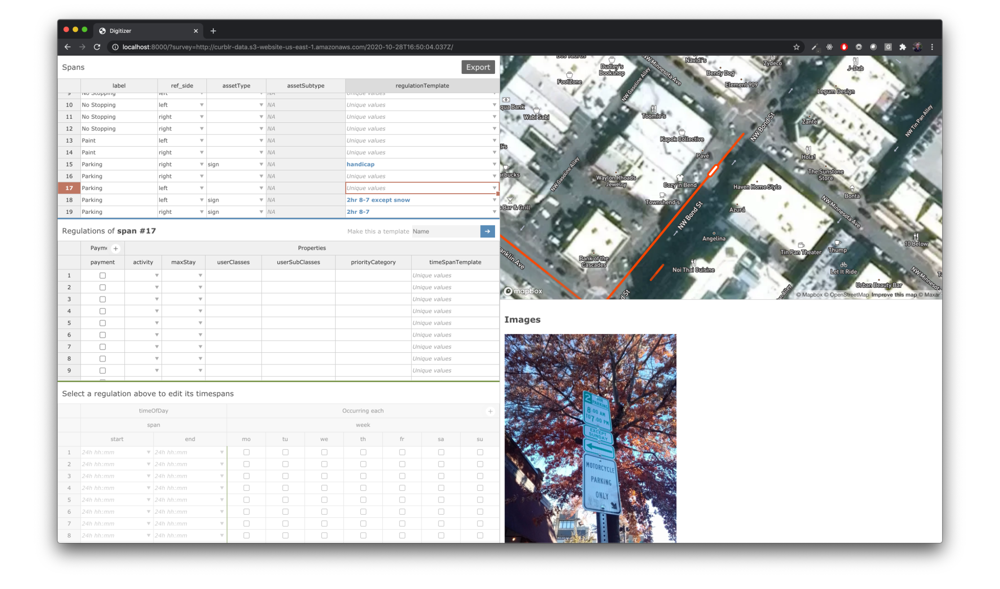
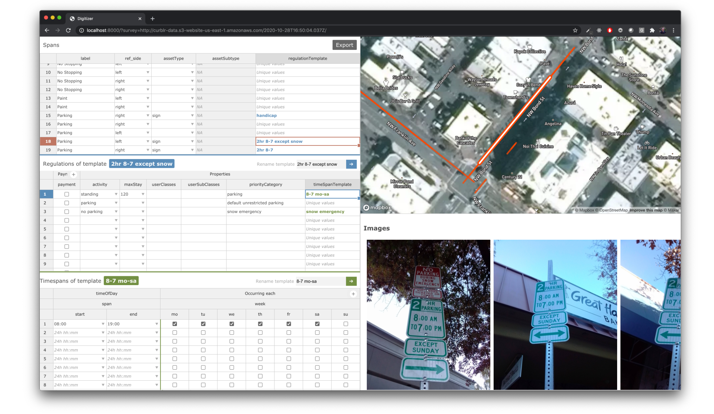
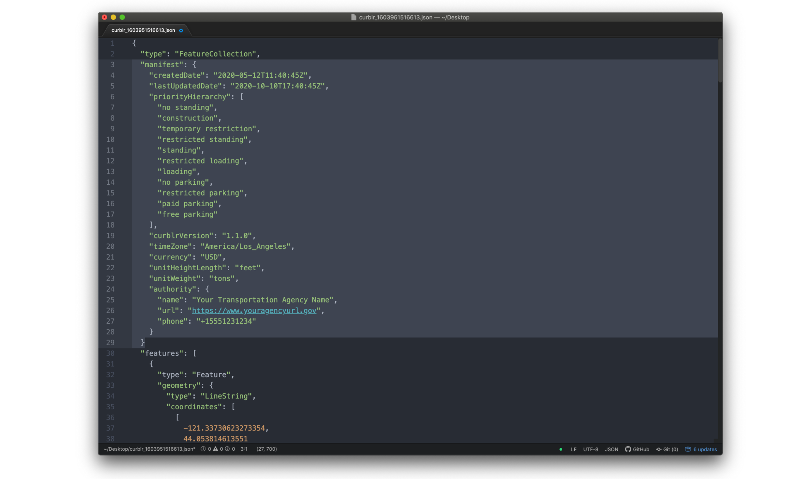

## How to digitize the data into a CurbLR feed

The digitizer can be run locally or accessed through a hosted version. It will pull in the data you uploaded and display the curb segments on a map, alongside images that were captured. The link to your survey data from the wheel can be accessed through the app (see [app instructions](https://docs.google.com/presentation/d/1NqRnIblEEMXaFtzdQwLsId2Zoh3sRvoiIRdQ_2HDb48/edit#slide=id.ga62d08dcdb_0_285)).

On the left are tables where you will enter the regulation information. The top table contains all the individual segments. The second contains the regulation information for a selected segment. The third contains timespan information for a selected segment.

To begin, select an individual segment and complete any relevant fields in the first table. Then move to the second table and enter in the relevant regulation info (e.g. “activity = no parking”). If that regulation has a timespan restriction, move to the third table and enter it there.

Most cities have a handful of rules that repeat over and over again, so to make digitizing more efficient, you can give the regulation a name and make it a template. Once a regulation is templated, you can apply it to other curb spans using a dropdown, or by copying and pasting over multiple cells. You can do the same thing to create and apply timespan templates, as shown above.

More detailed instructions and tips are available [here](https://github.com/sharedstreets/curbwheel-digitizer/blob/master/usage.md).

When you’re finished, clicking “Export” will download the CurbLR JSON file as well as a GeoJSON of point features (such as photo locations and fire hydrants).

This testing version does not generate the metadata text for the CurbLR JSON, so you will need to add that to your data feed. Open the JSON in a text editor. In the beginning of the file, you’ll see the metadata with default values for the priority hierarchy, authority name and contact info, units of height/length/weight, etc - seen in the example below.

Customize the fields to be correct for your particular agency, timezone, etc. Pay special attention to the priorityHierarchy field; this should be a ranked list of all your `priorityCategory` names, in order of highest precedence. Save the JSON file when you are finished. You can give the file a new name if you prefer.
